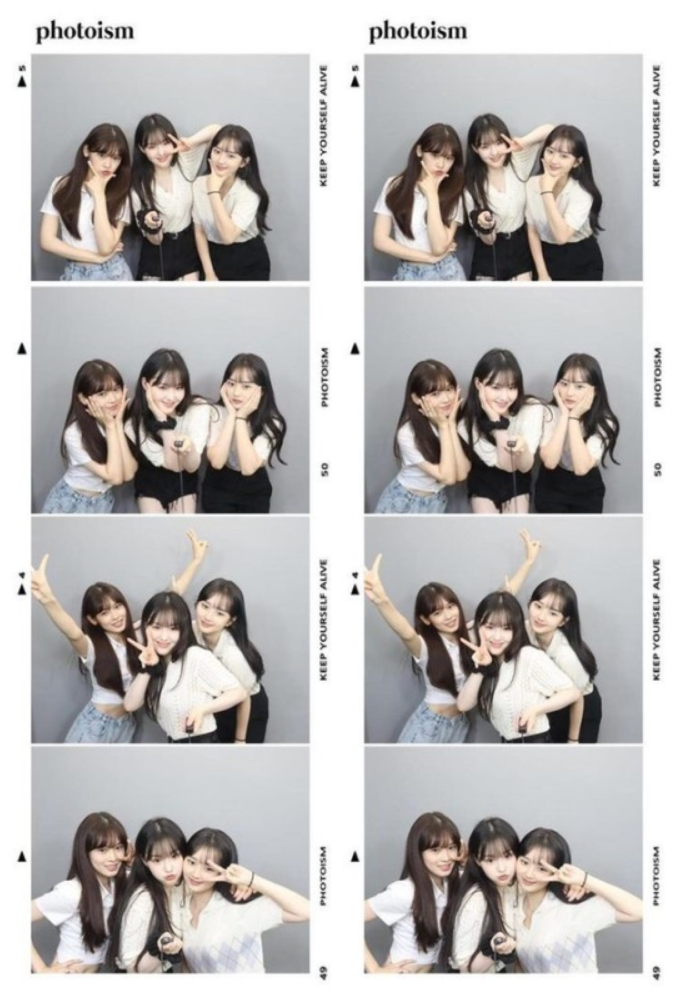
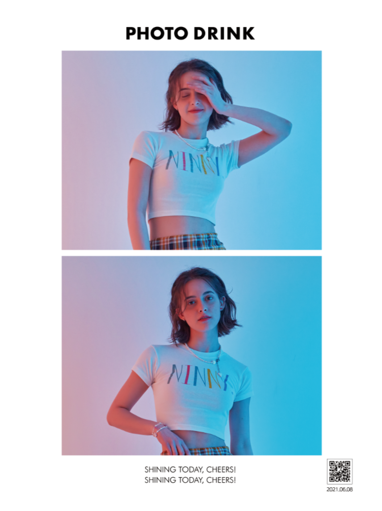
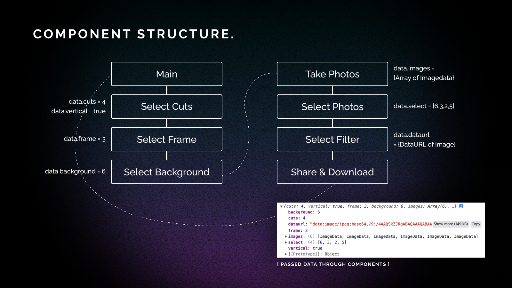
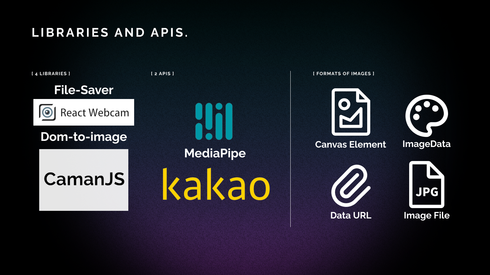
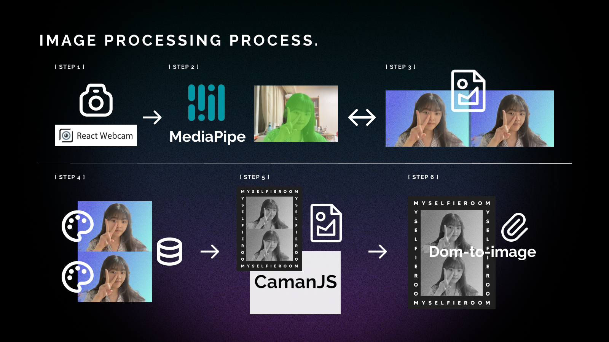
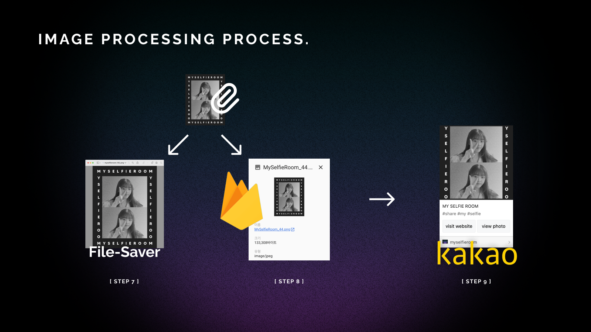

# My Selfie Room 🤳📸

### 👯‍♀️ Team Info
 **22S KAIST ID311 Final Project Team6**

20190699 Jongok Hong

20190835 Juwon Oh

20200529 Hyewon Lee 

 

### 📎 Project Info

 

### 🛠️ Project Skills

---

## 🎀 **Concepts**
**Introduction** Nowadays, self photo studios with different styles of frames, backgrounds, and filters are in fashion. We thought it would be fun to make our own online photo booth. 

 
 

**Design concept** We wanted to make a trendy mood using grayscale & neon color theme. Also, we used grain texture to make a vibe of nostalgic film camera.

---

## ⌨️ **Implementation**

---

> ### **Flow Design**

**MySelfieRoom** has a below user flow consist of a total 8 steps.
User can choose number of photo **cuts**, **frame** design, **background** design in order and **take** photos with virtual background. After taking photo, user can **select** photos which they want and can apply some **filters**. Finally user can **share** the photo via Kakaotalk or download in local environment.

We chose **React** as the framework for creating a single-page web project. We construct components that correspond to each step, and called them in a series and rendered according to the flow. 

During this flow, the object which includes user selections 
`{cuts:num, vertical:bool, frame:num, background:num, images:Array(ImageDta), select:Array(num), dataurl:dataURL}` is passing by  props. The key-value pairs are accumlated to this object as it passes through each component.

This project was implemented to be a good design from the following properties.
- **Learnability**
    1. Cursor hover animation for all clickable components
- **Efficiency**
    1. Take process initiate and terminate automatically without additional action
    2. User can re-order the photo selections
- **Safety**
    1. User cannot move to nextstep without any selection
    2. On the take stage, timer will be started after API respond arrived

---

 

>### **Function Design**
This project are using 4 libraries, 2 APIs with firebase database and storage.

Each of above libraries and APIs wanted different image type such as **Canvas element, ImageData, DataURL, image file(png or jpeg)**. This project is constructed to dealing with various types of image with following process.

`Step1`
First camera data from react-webcam library is send to MediaPipe machine learning model.
`Step2`
Then, it return detected (background)area that can be used in HTML canvas element.
`Step3`
With this data, draw camera data only on the detected area and draw background that user selected on the rest area on Canvas element.Then it will be look like that the virtual background is applied to image. This step is exectued 60 times per 1 second just like p5.js canvas drawing while the camera is ON state.

`Step4`
Taking photo is proceed by extracting ImageData of Canvas at certain points.
After user makes selection, draw selected photo with ImageData on canvas which is stored in the previous step.

`Step5`
Then, Caman js library applies filter on that canvas.

`Step6`
On the final stage dom-to-image library converts our Canvas to DataURL.

`Step7`
With this DataURL, first png file is generated by file-saver library and store it to user’s local environment.

`Step8`
Second it is send to firebase storage and firebase saves this DataURL as png file.

`Step9`
Lastly png url which is on the firebase storage is send to Kakao API then user can share this photo to our friends.

---
 

## 👊 **Chanllenges**

1. **Find appropriate Libraries/APIs and Connect**

    : The most tricky part was to make an order of library used to match input-output types. (Solution is already mentioned)
2. **API request latency**

    : There was some latency with getting request respond, so used states as flag and observe flag changes to resume next step

3. **Firebase network problem NET::_ERR_[?]**

    : There was unidentified network error with firebase storage. It was solved through the following attempts, and the biggest cause was unstable connection.
    - Delete browser cache
    - Reconnect to stable wifi
    - Change a firebase storage location to asia-northeast3(Seoul)
