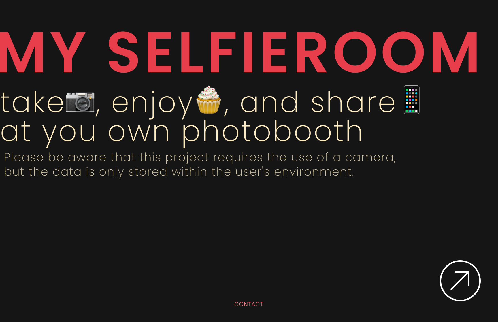
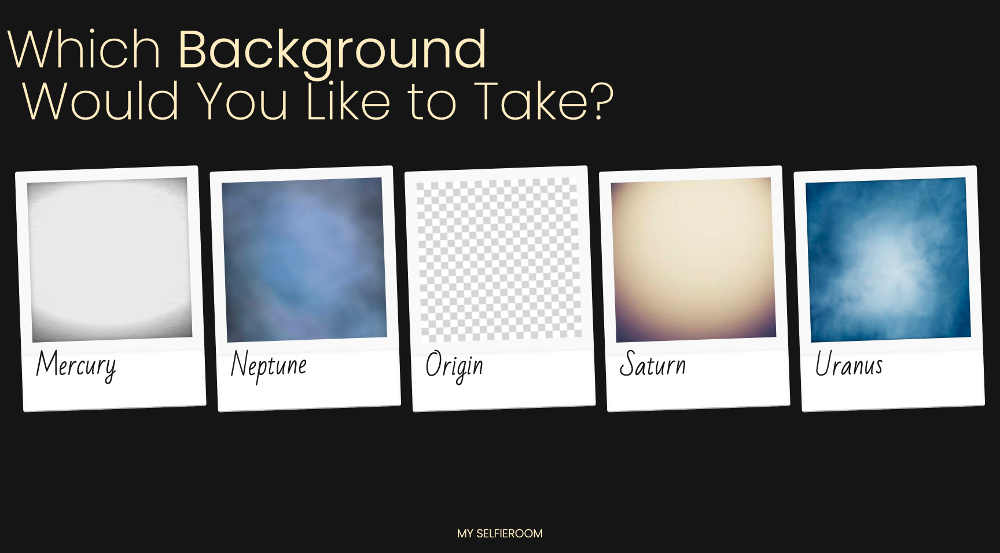
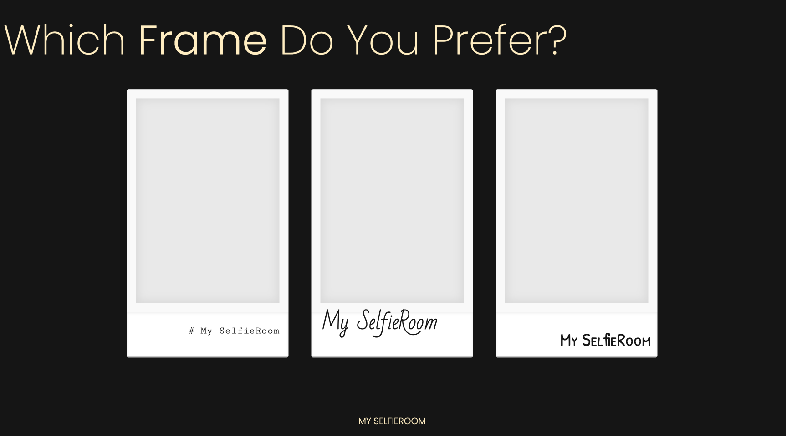

# My Selfie Room 🤳

This is the redesigned and refactored project ([original repository](https://github.com/hye1ee/KAIST-22S-ID311-Team6))

### DEMO IS HERE!! 📸

[Visit our demo](https://my-selfie-room.vercel.app/) and feel free to put feedback as github issues.

### COMMING SOON 🎀

- [ ] Filter applied photo download
- [ ] Mobile compatibility

##  

### My Selfie Room

is a web-based online photobooth where you can take y2k aesthetic photos. It provides 3 polaroid styles of frame with different fonts. You can take photo on 5 different virtual backgrounds by Mediapipe machine learnign APIs.

 
 
 

---

### Implementation

The origin project was designed based on pure React. During consequetive 8 steps of user flow, its states were reiteratively got across child components.

> **MySelfieRoom** has a below user flow consisting of a total of 8 steps. Users can choose a number of photo **cuts**, **frame** design, **background** design in order and **take** photos with virtual background. After taking photos, users can **select** photos that they want and apply some **filters**. Finally user can **share** the photo via download in the local environment. (**Currently photo without filters is only downloadable**)

In this project, all states are managing via **Recoil** state and implemented with **Typescript** for scalability.
Additional features such as decorating will be released soon!
